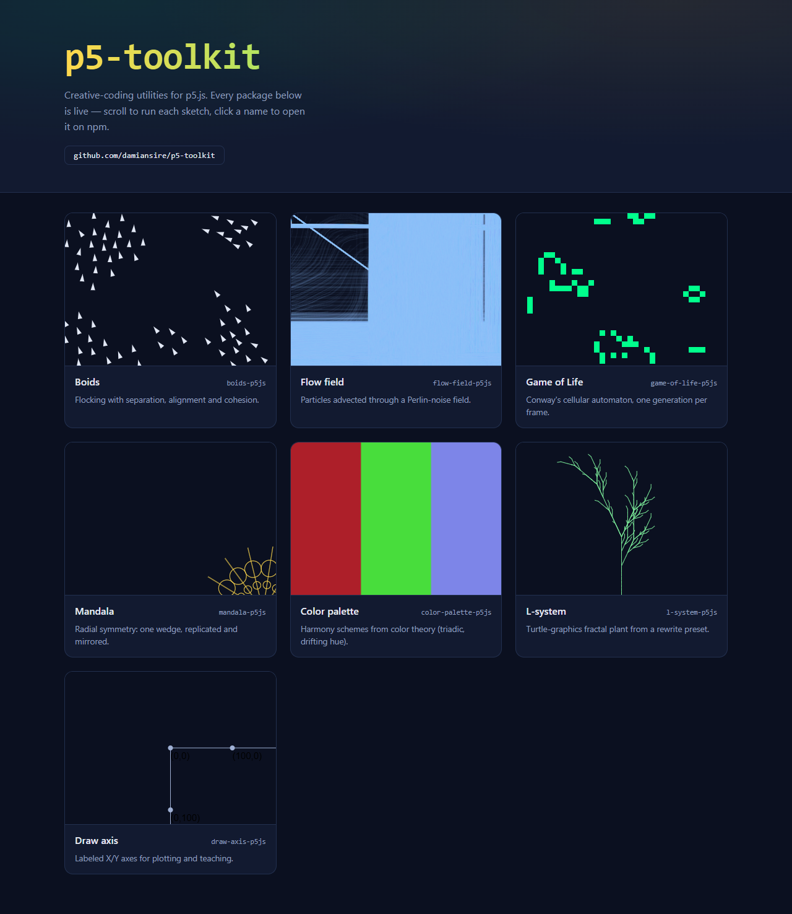

# p5-toolkit

Creative-coding utilities for [p5.js](https://p5js.org/), organized as an npm-workspaces monorepo. Each package is published to npm under its own name, but they evolve together here.

[](showcase)

<p align="center"><em>Every package, rendered live in the <a href="showcase">showcase</a> gallery — boids, flow fields, Game of Life, mandalas, colour palettes, L-systems and plotting axes.</em></p>

## Showcase

[`showcase/`](showcase) is a live gallery: every package rendered as an interactive
p5.js sketch on one page (boids flocking, a flow field, Game of Life, a spinning
mandala, an L-system plant, drifting palettes and plotting axes). Sketches are
instantiated lazily and paused off-screen.

```bash
cd showcase && npm install && npm run dev
```

## Packages

| Package                                   | npm                                                     | What it does                                      |
| ----------------------------------------- | ------------------------------------------------------- | ------------------------------------------------- |
| [`draw-axis`](packages/draw-axis)         | [npm](https://www.npmjs.com/package/draw-axis-p5js)     | Draw coordinate axes in p5.js sketches.           |
| [`flow-field`](packages/flow-field)       | [npm](https://www.npmjs.com/package/flow-field-p5js)    | Perlin-noise flow fields + particle advection.    |
| [`l-system`](packages/l-system)           | [npm](https://www.npmjs.com/package/l-system-p5js)      | L-systems and turtle-graphics fractal plants.     |
| [`game-of-life`](packages/game-of-life)   | [npm](https://www.npmjs.com/package/game-of-life-p5js)  | Conway's Game of Life and B/S cellular automata.  |
| [`boids`](packages/boids)                 | [npm](https://www.npmjs.com/package/boids-p5js)         | Boids flocking (separation, alignment, cohesion). |
| [`color-palette`](packages/color-palette) | [npm](https://www.npmjs.com/package/color-palette-p5js) | Generative palettes from color-theory harmonies.  |
| [`mandala`](packages/mandala)             | [npm](https://www.npmjs.com/package/mandala-p5js)       | Radial-symmetry mandala / kaleidoscope patterns.  |

## Conventions

Every package follows the same shape so they stay easy to publish and maintain:

- Takes the **p5 instance as an argument** (works in instance mode and global
  mode) — never reaches into `window` or assumes global mode.
- `p5` is a **peer dependency** (`^1.0.0`), never a hard dependency.
- An `exports` map + a `files` allowlist so the published tarball ships only the
  source, README and LICENSE.
- Pure, p5-free logic split out into testable functions, covered by
  `node --test` (no canvas needed).

## Roadmap

`draw-axis` was the first published utility; a family of generative-art modules
(flow fields, L-systems, cellular automata, boids, palettes, mandalas) followed.
Candidate additions (only when each is genuinely useful and tested, not to
inflate the monorepo):

- A grid / ruler helper.
- Coordinate-mapping utilities (screen ↔ world space).
- More creative-coding modules (reaction-diffusion, Voronoi art, perfect noise
  loops, generative typography).

## Development

```bash
npm ci
npm run lint                           # eslint over the whole monorepo
npm run format:check                   # prettier --check (formatting gate)
npm test --workspaces --if-present     # run every package's tests
npm pack --workspaces --dry-run        # validate the publishable tarballs
```

CI (`.github/workflows/ci.yml`) runs four blocking jobs on every push and pull
request: `lint` (eslint), `format` (`prettier --check`), the `test` + build
matrix (Node 18/20/22), and a `npm pack` dry-run.
